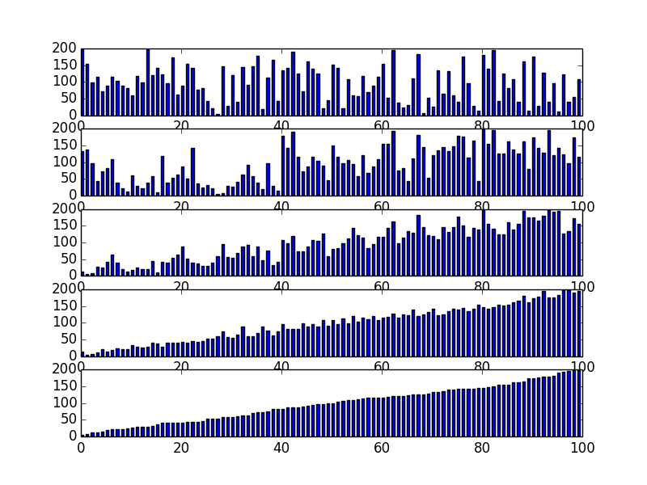
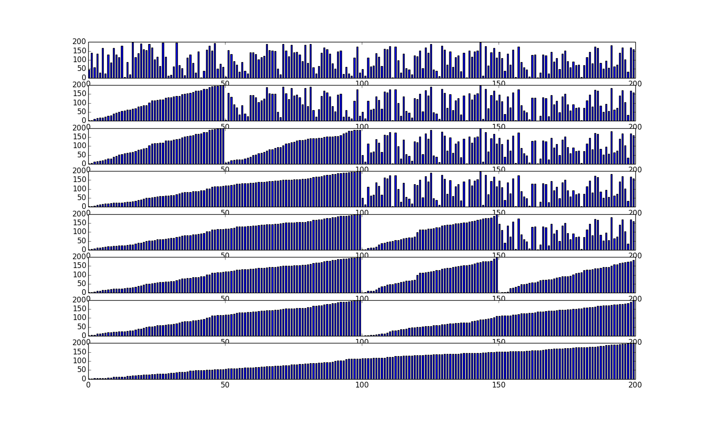

# 概述

排序是将一组对象按照某种逻辑顺序重新排列的过程。而现在大部分编程语言都提供了排序算法，但是弄清楚排序算法还是有很多好处的。

* 通过对排序算法的分析有助于理解其他高深的算法
* 项目中遇到特定的排序问题，可以更具不同的应用场景选择不同的排序算法
* 很多面试题目里面也饱含了对排序算法的分析

整个算法的实现主要是参考 _<<算法>>(第四版)_ ，不过该书的算法实现主要是通过Java实现的。为了能达到学习的目的，我在这里将采用Python实现排序算法。不过后期可能考虑用其他语言编写，例如C/C++。

整个算法可以从我的[GitHub](https://github.com/Cyrilplus/Algorithms)中进行下载，当然里面还包含了其它算法。排序算法主要在Sorted目录下。

# 选择排序

> 一种最简单的排序算法是这样的：首先，找到数组中最小的元素，其次，将它和数组的第一个元素交换位置（例如第一个元素就是最小元素那么它就和它自己交换）。再次，在剩下的元素中找到最小的元素，将它与数组的第二个元素交换位置。如此往复，直到将整个数组排序。这种方法叫做选择排序，因为它在不断地选择剩余元素之中的最小者。—— _<<算法>>(第四版)_

i  | min | 10 | 3 | 7 | 1 | 2 | 9
:--:|:---:|:---:|:---:|:---:|:---:|:---:|:--:
0  | 1  | <font color="red">1</font> | 3  | 7  | <font color="red">10</font>  | 2  |  9
1  | 2  | 1  | <font color="red">2</font>  | 7  | 10  | <font color="red">3</font>  |  9
2  | 3  | 1  | 2  | <font color="red">3</font>  | 10  | <font color="red">7</font>  |  9
3  | 7  | 1  | 2  | 3  | <font color="red">7</font>  | <font color="red">10</font>  |  9
4  | 9  | 1  | 2  | 3  | 7  | <font color="red">9</font>  | <font color="red">10</font>

图 1. 选择排序轨迹

丛上图可以清楚看出来，该算法每次都是找到剩余的最小值和要找的第i小的值交换。对于长度为N的数组，选择排序需要大约N^2/2次比较和N交换。

``` python
#!/usr/bin/env python
# -*-coding:utf-8 -*-
"""
作者：Cyril
时间：2016年1月3号

选择排序：
   首先，找到数组中的最小元素，然后和第一个元素交换位置
然后剩下的数组中再找到最小值和第二个数据交换，以此类推。
提供了自定义比较函数
"""


def select_sorted(seq, comparator=cmp):
    count = len(seq)
    for i in range(0, count):
        min_val = seq[i]
        min_index = i
        # 选择剩下的最小值
        for j in range(i + 1, count):
            if comparator(seq[j], min_val) < 0:
                min_val = seq[j]
                min_index = j
        # 交换
        seq[i], seq[min_index] = seq[min_index], seq[i]


if __name__ == '__main__':
    date = [8, 10, 5, 6, 1, 9]
    # 从大到小排序
    select_sorted(date, lambda x, y: cmp(y, x))
    print date
    # 默认从小到大排序
    select_sorted(date)
    print date
```

# 插入排序

> 通常人们整理桥牌的方法是一张一张的来，将每一张牌插入到其他已经有序的牌中的适当的位置。在计算机的实现中，为了给要插入的元素腾出空间，我们需要将其余所有元素在插入之前都向右移动一位。这种算法叫插入排序。—— _<<算法>>(第四版)_

i | 23 | 10 | 3 | 17 | 11 | 22 | 94
:--:|:---:|:---:|:---:|:---:|:---:|:---:|:--:
0 | <font color="red">10</font> | <font color="red">23</font> | 3 | 17 | 11 | 22 | 94  
1 | <font color="red">3</font> | 10 | <font color="red">23</font>  | 17  | 11  | 22  | 94  
2 | 3 | 10 | <font color="red">17</font> | <font color="red">23</font> | 11 | 22 | 94  
3 | 3 | 10 | <font color="red">11</font> | 17 | <font color="red">23</font> | 22 | 94  
4 | 3 | 10 | 11 | 17 | <font color="red">22</font> | <font color="red">23</font> | 94  
5 | 3 | 10 | 11 | 17 | 22 | <font color="red">23</font> | <font color="red">94</font>

图 2. 插入排序轨迹

丛上图可以查出，当第一遍历的时候，是将第二个元素和第一个元素进行比较。发现第二个元素（10）比第一个元素（23）小，交换他们的位置。第二次遍历的时候，将第三个元素（3）和第二个元素（23）比较，发现第三个元素（3）比第二个元素（23）小，交换位置。这个时候将第二个元素（发生改变了，变成3了）和第一个元素（10）比较，发现第二个元素（3）比第一个元素（10）小，将它们交换位置。以此类推，每次遍历都保证了左边的数据是有序的。直到遍历最后一个，整个数组就有序了。当输入数组是有序的时候，插入排序能够很快完成。所以插入排序能利用数组的初始特性。

``` python
#!/usr/bin/env python
# -*- coding:utf-8 -*-
"""
作者：Cyril
时间：2016年1月3号

插入排序：将数据分为两边，左边始终有序。每次插入要相应的移动左边数组。
"""


def insert_sorted(sequence, compare=cmp):
    count = len(sequence)
    for i in range(1, count):
        # 将 array[j]插入到左边的有序数组中，丛右向左遍历
        for j in range(i, 0, -1):
            if compare(sequence[j], sequence[j - 1]) < 0:
                # swap
                sequence[j], sequence[j - 1] = sequence[j - 1], sequence[j]


if __name__ == '__main__':
    array = [10, 2, 3, 5, 8, 6]
    insert_sorted(array)
    print array
```

# 希尔排序

希尔（Shell）排序是一种基于插入排序的快速排序算法。对于大规模乱序数组插入排序很慢，因为它只会交换相邻的元素，因此元素元素只能一点一点地从数组一端移动到另一端。希尔排序为了加速简单地改进了插入排序，交换不相邻的元素一对数组的局部进行排序，并最终用插入排序将局部有序的数组排序。

> 希尔排序的思想是使数组中任意间隔为h的相邻元素都是有序的。这样的数组被称为h有序数组。换句话说，一个h有序数组就是h个互相独立的有序数组编织在一起组成的一个数组。—— _<<算法>>(第四版)_

  2 | 1 | 4 | 0 | 6 | 3 | 11 | 5 | 10 | 9 |13 | 7
:--:|:---:|:---:|:---:|:---:|:---:|:---:|:---:|:---:|:---:|:---:|:--:
  2 |   |   |   | 6 |   |    |   | 10 |   |   |  
    | 1 |   |   |   | 3 |    |   |    | 9 |   |  
    |   | 4 |   |   |   | 11 |   |    |   | 13 |   
    |   |   | 0 |   |   |    | 5 |    |   |    | 7  

图 3. 一个h＝4有序数组即一个由h＝4个有序子数组组成的数组

``` python
#!/usr/bin/env python
# -*- coding:utf-8 -*-

"""
作者：Cyril
时间：2016年1月4号

希尔排序：
    插入排序的升级版，相隔为h的序列是有序的，然后不断缩小h。
知道h为1，这个最后一步就是插入操作。由于插入排序的性质，受输入
序列的顺序的影响。所以每一次插入排序都是在大部分是有序的序列上操
作的，所以速度很快。
"""


def shell_sorted(seq, comparator=cmp):
    count = len(seq)
    h = 1
    print count
    # 希尔间隔算子，貌似中不同值效果不一样，也有关于最优的选择，
    # 这里就不再讨论，有兴趣自行搜索
    while h < count / 3:
        h = h * 3 + 1
    # 这里是三层循环，其实内两层循环和插入排序基本上一模一样
    # 最外一层循环主要是取不同的间隔h，但最终间隔h＝1，最终使用插入排序
    while h >= 1:
        for i in range(h, count):
            for j in range(i, h - 1, -h):
                if comparator(seq[j], seq[j - h]) == -1:
                    seq[j], seq[j - h] = seq[j - h], seq[j]
        h /= 3  # 间隔不断缩短直到1

if __name__ == '__main__':
    array = [10, 4, 2, 5, 6, 1]
    shell_sorted(array)
    print array
```

下面我们将采用柱状图的形式来跟踪插入排序算法的轨迹。主要是试用Python的[matplotlib](http://old.sebug.net/paper/books/scipydoc/matplotlib_intro.html)和[numpy](http://old.sebug.net/paper/books/scipydoc/numpy_intro.html)两个package。第一个包主要是类似于Matlab画图，第二个包类似于Matlab的矩阵操作（数值计算）。所以说Python是一门功能比较丰富的编程语言。



``` python
# -*- coding:utf-8 -*-

"""
希尔排序：
    插入排序的升级版，相隔为h的序列是有序的，然后不断缩小h。
知道h为1，这个最后一步就是插入操作。由于插入排序的性质，受输入
序列的顺序的影响。所以每一次插入排序都是在大部分是有序的序列上操
作的，所以速度很快。
"""

import numpy as np
import matplotlib.pyplot as plt


def shell_sorted(seq):
    count = len(seq)
    h = 1
    x = np.arange(count)
    rows = 1
    while h < count / 3:
        h = 3 * h + 1
        rows += 1
    fig, axes = plt.subplots(ncols=1, nrows=rows + 1)
    axes_tuple = axes.ravel()
    index = 0
    axes_tuple[index].bar(x, np.array(seq), 0.5)
    index += 1
    while h >= 1:
        # 插入排序，步进为h->1
        for i in range(h, count):
            for j in range(i, h - 1, -h):
                if seq[j] < seq[j - h]:
                    # swap
                    seq[j - h], seq[j] = seq[j], seq[j - h]
        axes_tuple[index].bar(x, np.array(seq), 0.5)
        index += 1
        h /= 3
    plt.show()


if __name__ == '__main__':
    array = np.random.randint(0, 200, (1, 100))[0]
    shell_sorted(list(array))
```

# 冒泡排序

冒泡排序是最经典的排序之一，它重复地走访过要排序的数列，一次比较两个元素，
如果他们的顺序错误就把他们交换过来。走访数列的工作是重复地进行直到没有再需要交换，
也就是说该数列已经排序完成。这个算法的名字由来是因为越大的元素会经由交换慢慢“浮”
到数列的顶端，故名冒泡排序。

由于排序算法比较常用，接触过排序算法的人基本上都知道冒泡排序，这里面就不给出排序轨迹了。

``` python
#!/usr/bin/env python
# -*- coding:utf-8 -*-

"""
作者: Cyril
冒泡排序：
    冒泡排序是最经典的排序之一，它重复地走访过要排序的数列，一次比较两个元素，
如果他们的顺序错误就把他们交换过来。走访数列的工作是重复地进行直到没有再需要交换，
也就是说该数列已经排序完成。这个算法的名字由来是因为越大的元素会经由交换慢慢“浮”
到数列的顶端，故名冒泡排序。
"""


def bubble_sorted(sequence, comparator=cmp):
    count = len(sequence)
    for i in range(0, count - 1):
        for j in range(0, count - 1 - i):
            if comparator(sequence[j], sequence[j + 1]) > 0:
                sequence[j], sequence[j + 1] = sequence[j + 1], sequence[j]


if __name__ == '__main__':
    array = [3, 4, 10, 1, 9, 5]
    bubble_sorted(array, lambda x, y: cmp(y, x))
    print array
    print help(bubble_sorted)
```

# 归并排序

要将一个数组排序，可以先（递归地）将它分成两半分别排序，然后将结果归并起来。归并，即将两个有序的数组归并成一个有序数组。你将会看到，归并排序最吸引人的性质是它能够保证将任意长度为N的数组排序时间和NlogN成正比；它主要的缺点则是它需要额外空间和N成正比。归并排序一种是采用自顶向下的递归算法，一种是采用自底向上的非递归算法。

## 自顶向下的递归算法

这种递归归并算法是应用高效算法设计 _中分治思想_ 的最典型的例子之一。下面递归代码是归纳证明算法能够将数组排序的基础，如果它能将两个子数组排序，它就能通过归并两个子数组来将整个数组排序。其实，递归到最后一层就是两个只含有一个元素的子数组进行排序。只含有一个元素的子数组当然可以直接通过归并来排序啦。

``` python
#!/usr/bin/env python
# -*- coding:utf-8 -*-
'''
归并排序：
    递归归并排序。
'''


class Merge(object):
    '''
    归并排序
    参数：
        array:是需要排序的数组
        compare:是比较函数，默认使用系统自带的cmp
    例子：
        array = [10 11 4 12 9 1]
        merge = Merge(array)
        merge.mergeSorted()
        array will be [1 4 9 10 11 12]

    '''

    def __init__(self, array, compare=cmp):
        '''
        归并排序
        参数：
            array:是需要排序的数组
            compare:是比较函数，默认使用系统自带的cmp
        '''
        self.array = array
        self.compare = compare

    def merge(self, lo, mid, hi):
        '''
        归并插入：
            将array[lo...mid]和array[mid+1...hi](是有序的数组)，归并成一个有序的数组。
            并将结果存在原array数组里面
        参数：
            lo:是数组的低索引
            mid:是数组的中点
            hi：数组的高索引
        '''
        indexOfLo = 0
        indexOfHi = 0
        left = self.array[lo:mid + 1]
        right = self.array[mid + 1:hi + 1]
        lenOfLeft = len(left)
        lenOfRight = len(right)

        for i in range(lo, hi + 1):
            if indexOfLo >= lenOfLeft:
                self.array[i] = right[indexOfHi]
                indexOfHi += 1
            elif indexOfHi >= lenOfRight:
                array[i] = left[indexOfLo]
                indexOfLo += 1
            elif self.compare(left[indexOfLo], right[indexOfHi]) == -1:
                array[i] = left[indexOfLo]
                indexOfLo += 1
            else:
                array[i] = right[indexOfHi]
                indexOfHi += 1

    def sorted(self, lo, hi):
        '''
        递归排序：
            使用中分治思想，递归知道需要将两个元素进行归并插入
        参数:
            lo:数组低索引
            hi:数组高索引
        '''
        mid = int((lo + hi) / 2)
        if hi <= lo:
            return
        self.sorted(lo, mid)
        self.sorted(mid + 1, hi)
        self.merge(lo, mid, hi)

    def mergeSorted(self):
        '''
        归并排序：
            调用self.sorted函数，设置好数组的长度
        '''
        self.sorted(0, len(self.array) - 1)

if __name__ == '__main__':
    array = [10, 11, 12, 0, 1, 2, 100, 89, 47]
    merge = Merge(array)
    merge.mergeSorted()
    print array
```



图 4. 自顶向下的递归归并排序轨迹

由于篇幅的限制，这部分代码我在这里就不贴出来了，有兴趣可以到我的GitHub查看源代码。

## 自底向上的非递归算法

从上面的自顶向下的递归排序可以看出，是通过递归先把数组一分为二，然后再将子数组一分为二。最好归并的是子数组为一个元素的数组。那么还有另一种方法就是我们第一步就开始归并两个只有一个元素的子数组，然后归并已经有序很有两个元素的子数组，最好整个数组通过归并成有序。也就是说第一次归并数组长度为1（将索引为0，1进行归并，2，3归并，4，5归并，...），第二次归并数组长度为2（将0～1和2～3归并，4～5和6～7归并，...），因为长度为2的子数组已经是有序的了。以及类推，直到子数组长度大于原始数组长度。最后整个数组有序。

``` python
#!/usr/bin/env python
# -*- coding:utf-8 -*-

"""
作者：Cyril
时间：2016年1月5号
归并排序：
    非递归归并排序。
"""


def merge(sequence, lo, mid, hi, compare=cmp):
    left = sequence[lo:mid]
    right = sequence[mid:hi + 1]
    left_len = len(left)
    right_len = len(right)
    index_lo = 0
    index_hi = 0
    for i in range(lo, hi + 1):
        if index_hi >= right_len:
            sequence[i] = left[index_lo]
            index_lo += 1
        elif index_lo >= left_len:
            sequence[i] = right[index_hi]
        elif compare(left[index_lo], right[index_hi]) == -1:
            sequence[i] = left[index_lo]
            index_lo += 1
        else:
            sequence[i] = right[index_hi]
            index_hi += 1


def merge_sorted(sequence):
    length = len(sequence)
    step = 1
    while step < length:
        lo = 0
        while lo < length - 1:
            hi = min(lo + step + step - 1, length - 1)
            mid = lo + step
            merge(sequence, lo, mid, hi)
            lo = hi + 1
        step *= 2


if __name__ == '__main__':
    array = [10, 11, 12, 1, 2, 3]
    merge_sorted(array)
    print array
```

# 快速排序

> 快速排序是一种分治排序算法。它将一个数组分成两个子数组，将两部分独立地排序。快速排序和归并排序是互补的：归并排序讲数组分成两个子数组分别排序，并讲有序的子数组归并以将整个数组排序；而快速排序将数组排序的方式则是当两个子数组都有序时整个数组也就自然有序了。—— _<<算法>>(第四版)_

## 快速排序基本思路

在快速排序中，先选择数组里面一个元素作为切分元素。将数组分成不大于这个切分元素的子数组和不小于这个切分元素的子数组。

``` python
#!/usr/bin/env python
# -*- coding-utf-8 -*-


def quick_sorted(seq, lo, hi, compare=cmp):
    if hi <= lo:
        return
    lt = lo
    i = lo + 1
    gt = hi
    v = seq[lo]
    while i <= gt:
        cmp_value = compare(seq[i], v)
        if cmp_value < 0:
            seq[i], seq[lt] = seq[lt], seq[i]
            i += 1
            lt += 1
        elif cmp_value > 0:
            seq[i], seq[gt] = seq[gt], seq[i]
            gt -= 1
        else:
            i += 1
    quick_sorted(seq, lo, lt - 1)
    quick_sorted(seq, gt + 1, hi)

if __name__ == '__main__':
    array = [1, 3, 2, 2, 9, 4, 4, 10, 6]
    quick_sorted(array, 0, len(array) - 1)
    print array
```

# 堆排序

## 优先队列

有时候我们不需要将整个数据进行排序，我们每次获取最大值（或者最小值）。在这种情况下，将整个数组排序代价比较高。在这种情况下，一个合适的数据结构支持两种操作：删除最大元素和插入元素。这种数据类型叫做优先队列。下面我们将要看到是基于 _二叉堆_ 数据结构的一种优先队列的经典实现，用数组保存元素并按照一定条件排序，已实现高效地（对数级别的）删除最大元素和插入元素操作。

### 堆定义

> 数据结构二叉堆能够很好地实现优先队列的基本操作。在二叉堆的数据中，每个元素都要保证大于等于另外两个特定位置的元素（大于子节点）。相应地，这些位置的元素又至少要大于等于数据中的另两个元素，以此类推。如果我们将所有元素画成一颗二叉树，将每个较大和较小的元素用边连接就可以很容易看出这种结构了。当一颗二叉树的每个节点都大于等于它的两个子节点是，它被称为堆有序。—— _<<算法>>(第四版)_

### 二叉堆表示法

要表示一个课二叉树，我们很容易想到用指针来做（Java以及其它面向对象语言可以用引用来表示），那么我们的数据结构就要保存两个子节点的的指针，一个变量来保存值。但是如果我们使用完全二叉树，可以先定下根节点，然后一层一程地由上向下，从左至右，在每个节点的下方连接两个更小的节点，直至将N哥节点全部连接完毕。完全二叉树只需要用数组而不需要用指针就可以表示。 _具体方法就是将完全二叉树的节点按照层次顺序放入数组中，根节点的位置1，它的子节点的位置2和3，二子节点的子节则分别在位置4，5和6，7，以此类推_ 。

#### 为什么根节点放在索引为1的位置而不是0？

这样做的好处是方便计算。如果给点一个节点的索引是k，那么它的子节点分别是2*k和2*k + 1，其父节点为k／2（注意这个是取整操作。

### 堆的算法

在有序化的过程中我们会遇到两种情况。当某个节点的优先级上升（或是在堆底加入一个优先级高的元素）时，我们需要由下至上恢复堆的顺序。当某个节点优先级下降（删除操作，将最后一个元素放入根元素位置）时，我们需要由上至下恢复堆的顺序。

#### 由下至上的堆有序化（上浮）

如果堆的有序状态因为某个节点变的比它的父节点更大而被打破，那么我们就需要通过交换它和它的父节点来修复。交换之后，这个节点可能比这个父节点还要大，所以要一直修复直到满足父节点比子节点大为止。这个算法函数取名为swim，可以从下面的代码中看到。

### 由上至下的堆有序化（下沉）

如果堆的有序状态因为某个节点变的比它的两个子节点或是其中之一更小而破坏堆有序，那么我们可以通过将它和它的两个子节点中 _较大者_ 交换恢复。但是交换后可能还是比子节点小，所以不要不断修复，将节点不断下移直到满足比子节点大或者没有子节点。


``` python
#!/usr/bin/env python
# -*- coding:utf-8 -*-


class MaxPQ(object):
    def __init__(self, compare=cmp):
        self.cmp = compare
        self.pq = [0, ]
        self.N = 0

    def swim(self, k):
        while (k > 1) and (self.cmp(self.pq[k], self.pq[k / 2]) > 0):
            self.pq[k], self.pq[k / 2] = self.pq[k / 2], self.pq[k]
            k /= 2

    def insert(self, element):
        self.pq.append(element)
        self.N += 1
        self.swim(self.N)

    def get_array(self):
        return self.pq

    def sink(self, k):
        while (k * 2) <= self.N:
            j = 2 * k
            if j < self.N:
                if self.cmp(self.pq[j + 1], self.pq[j]) > 0:
                    j += 1
            if self.cmp(self.pq[j], self.pq[k]) > 0:
                self.pq[j], self.pq[k] = self.pq[k], self.pq[j]
                k = j
            else:
                break

    def del_max(self):
        max_val = self.pq[1]
        self.pq[1], self.pq[self.N] = self.pq[self.N], self.pq[1]
        self.N -= 1
        self.sink(1)
        return max_val


if __name__ == '__main__':
    print 'Example ...'
    max_pq = MaxPQ()
    max_pq.insert(10)
    max_pq.insert(20)
    max_pq.insert(70)
    max_pq.insert(40)
    max_pq.insert(50)
    print max_pq.N
    print max_pq.get_array()
    print max_pq.del_max()
    print max_pq.del_max()
    print max_pq.del_max()
    print max_pq.del_max()
    print max_pq.del_max()
    print max_pq.get_array()
```
